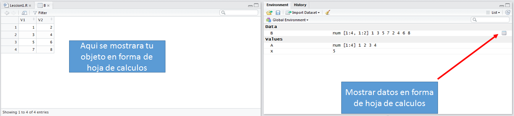

```{r setup, include=FALSE}
knitr::opts_chunk$set(echo = TRUE)
```


# Introduccion a Rstudio

Rstudio es un entorno integrado de dessarrolo o IDE (integrated development environment) para el lenguaje de programación R. El proposito de este software no es mas que facilitarle la vida a los programadores al integrar varios componentes que son comunmente usados durante el analisis de datos y desarrollo de software en R. Rstudio cuenta con varios componentes que se describiran a continuacion: la consola, un editor de textos, el entorno, el historial, y un visualizador de archivos y graficos.


## La Consola
Al abrir Rstudio, podemos encontrar la consola de el lado izquierdo de la pantalla. La consola tiene dos funciones. Primero, es el lugar donde podemos escribir comandos para que la computadora los ejecute. Segundo, es el medio principal de comunicacion de salida de texto (output). Al empezar una sesion de R, la consola nos mostrara el texto de bienvenida seguido por el simbolo de entrada de texto ">". Cuando ese simbolo esta presente, nos quiere decir que la computadora esta esperando nuestro comando.


Algo importante que hay que tener en mente es que Rstudio nos indica nuestro directorio de trabajo actual **(working directory)** en la parte de arriba de la consola. Es importante tener en cuenta cual es nuestro directorio de trabajo ya que las operaciones de lectura y escritura de datos a discos se realizaran relativo a este directorio. Para cambiar nuestro directorio de trabajo podemos usar el comando setwd() o usando el menu "Session" -> "Set Working Directory".


Vamos a tratar de empezar a usar R con operaciones basicas de aritmetica. Escribe las siguientes operaciones en la consola una linea a la vez. 

```{r operaciones, eval=FALSE}
5+2
5*2
5^2
print("Hola mundo!")
```

Rstudio tiene un modo de autocompletar muy conveniente para escribir codigo. Trata de escribir en la consola las primeras tres letras de la palabra print y te aparecera un dialog con sugerencias de funciones.

Tip: Si deseas limpiar el texto que se encuentra en la consola puedes presionar Ctrl+L

## Editor de Textos
Una de las funciones mas improtantes de Rstudio es el editor de textos que tiene integrado. El editor de texto es donde podemos escribir nuestros scripts (i.e., lineas de codigo que ejecutan una serie de comandos deseasdos) antes de ejecutarlos en la consola. 

Si es la primera vez que inicias una sesion de Rstudio, el editor de texto no aparecera en tu pantalla. Para mostrarlo puedes crear un archivo nuevo usando el menu File > New File > R Script. Trata de escribir (o copiar) el siguiente texto a el editor de textos:

```{r hola.mundo, eval=FALSE}
#Esto es un comentario
for( i in 1:10){
	print("Hola mundo!")
}
#print("Esto es un comentario y R lo ignorara.")
```

Podras darte cuenta que al igual que en este articulo, el texto tiene diferentes colores. Rstudio tiene la opcion de colorear cierto texto de tu codigo para hacerlo mas facil de leer. Palabras claves reservadas para R, por ejemplo los operadores 'for' y 'in' se muestran de un color. Texto que se interpreta como *strings* al estar dentro de comillas (" ") se muestra de otro color. Finalmente, los comentarios (i.e., porciones de tu codigo que no se ejecutan, pero sirven para anotar el codigo) se muestran de otro color. Mas adelante explicaremos para que sirven estas palabras claves y como comentar tu codigo.

Una vez que hemos escrito nuestro codigo, podemos ejecutarlo todo a la vez. Para hacer esto seleccionamos el codigo que deseamos ejecutar y presionames Ctrl+Enter o podemos dar click en el boton que dice "Run". Al hacer esto el texto es copiado a la consola y se ejecutara. El output debera de ser similar a lo que aparece abajo:

```{r hola.mundo2, echo=FALSE}
#Esto es un comentario
for( i in 1:10){
	print("Hola mundo!")
}
#print("Esto es un comentario y R lo ignorara.")
```

Te daras cuenta que el comentario (texto despues de #) es ignorado. No debes de preocuparte si estos acaban entrando como parte de nuestro input en la consola. 

TIP: Es importante que pongamos comentarios en nuestro codigo para poder entender facilmente tu codigo, en especial cuando alguien mas necesita leer tu codigo. Por ejemplo, tus colegas o instructores. Existen guias de estilo para comentar tu codigo que no tendremos tiempo para cubri, pero si te interesa puedes checar la guia de estilo que usa Google para R https://google.github.io/styleguide/Rguide.xml

## El Entorno
La ventana de entorno (workspace) muestra los **objetos** que se encuentra en la memoria durante nuestra sesion de R. La mayoria de los lenguajes de programacion modernos se manejan basados en objetos (object-oriented). Estos objetos son una representacion abstracta de datos y se asocian con un nombre que le damos nosotros. Mas adelante repasaremos los objetos basicos que son utilizados en R. Por ahora vamos a empezar creando objetos numericos en forma de escalares, vectores, y matrices. 

Abre el script guardado en el archivo "Leccion1.R" y ejecutalo.

```{r, eval=FALSE}
x <- 5			#escalar
x
A <- c(1,2,3,4) 	#vector
A
B <- matrix(c(1,2,3,4,5,6,7,8), nrow=4, ncol=2, byrow=TRUE)	#matriz
B
```

El operador que tiene forma de flecha <- esta formado por un signo de 'menor que' < y un guion. La primera linea crea un objeto llamado 'x' en la memoria y asignarle el numero 5. Podras ver que el objeto aparece en la ventana de entorno junto con su valor (5). Lo mismo sucede con el objeto 'A'. Finalmente, tenemos el objeto 'B' que es una matriz de 4 filas y 2 columnas. Rstudio tiene la funcion de mostrar algunos tipos de datos en forma de hoja de Excel, dandole click a el icono que aparece a la derecha de el objeto dentro de el entorno.



## El Historial
El historial guarda todos los comandos que se han ejecutado desde el inicio de la secion. Para ver el historial da click en "History" a lado de el "Workspace". Esta opcion es muy conveniente si te gusta escribir el condigo directamente en la consola y despues quieres guardarlo. Para hacer esto puedes dar click en el icono de guardar o en el icono de "To Source" que copiara el codigo seleccionado hacia el editor de textos.


## Explorador de archivos
Rstudio cuenta con un explorador integrado. Para accessarlo da click en el tab de "Files". Ahi podras encontrar los archivos que se encuentran en tu directorio de trabajo. Bajo el icono que dice "More" podras encontrar dos opciones utiles para ir o asignar el directorio de trabajo actual ("Go to Working Directory" y "Set As Working Directory").


## Explorador de paquetes

Uno de los valores mas grandes que tiene R es su gran comunidad de contribuidores. En particular en el area de bioinformatica. Muchas personas, en grupos o individualmente, crean paquetes y los comparten con los usuarios de R en manera de paquetes o librerias. Estos paquetes contienen funciones y objetos que agregan ciertas funcionalidades a nuestra sesion de R. En el tab "Packages" podremos ver los paquetes de R que estan instalados en nuestro sistema. Los paquetes que estan marcados son los que estan activos o cargados en nuestra sesion. Normalmente al iniciar una sesion los paquetes no se cargan para mantener al minimo el uso de la memoria.


Convenientemente Rstudio implementa una manera muy facil de instalar paquetes que se encuentran en el respositorio CRAN (el repositorio central de paquetes de R). Trata de instalar el paquete ggplot2 dando click en install. Despues asegurate que estas instalando de el repositorio (Repository (CRAN, CRANextra)) y busca el paquete ggplot2. Asegurate de que este marcada la opcion de instalar dependencias (Install dependencies) que instalara cualquier paquete que ggplot2 necesita.


Si el paquete se instalo correctamente te debera de aparecer en la consola el mensaje "package ‘ggplot2’ successfully unpacked and MD5 sums checked". Checa que ggplot2 aparezca en el tab de packages.

Para cargar este paquete a nuestra sesion podemos dar click en el cuadro a lado de ggplot2 o usar el siguiente codigo:

```{r, eval=FALSE}
library("ggplot2")
```

Trata de cargar ggplot2 ahora para usarlo en la siguiente seccion.

## Ventana de graficos

Una de las formas mas convenientes de explorar datos es visualizandola en forma de graficos. El paquete ggplot2 contiene funciones muy poderosas para generar graficos de alta calidad, incluyendo para publicaciones cientificas. Mas adelante exploraremos en detalle como generar estas gradicas usando ggplot.

Rstudio puede mostrar los graficos generados de una manera conveniente en la venta de "Plots". Corre el siguiente codigo para generar un plot:

```{r, warning=FALSE}
library("ggplot2")		# Asegurate que el paquete ggplot este cargado
x <- rnorm(100)		# Generar 100 valores aleatorios usando la distribucion normal
qplot(x)				# Muestra los resultados en forma de histograma
```

Este codigo mostrara el resultado de la grafica en la ventana Plots. Rstudio cuenta con un sistema de exportacion de graficos muy conveniente usando el boton de "Export". Guarda el resultado de esta grafica como pdf usando la opcion "Save as PDF". Ahi podras escoger el tamano de la grafica y el nombre de el archivo.


Todas las graficas que generes durante tu sesion se guardaran en le ventana de "Plots". Puedes usar las flechas en esa ventana para navegar por otras graficas que hayas generado previamente.

# Trabajando con R Markdown
